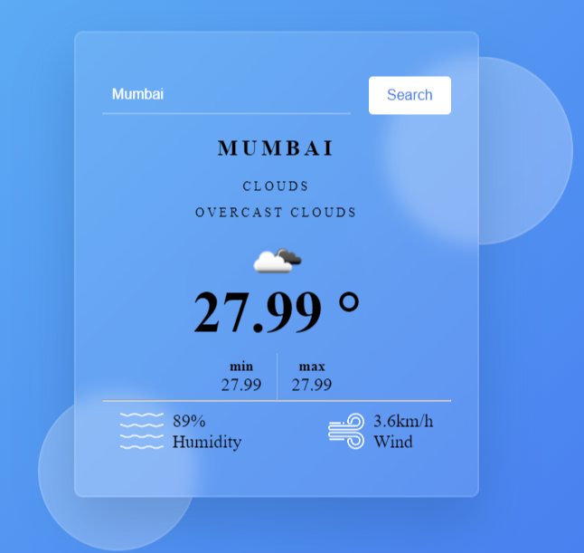
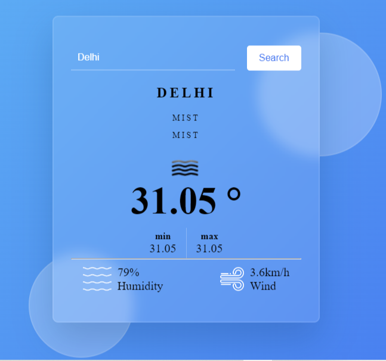

# ☀️ Weather Application ☔

Welcome to the Weather Application! This tool allows you to get the current weather information for any city with a simple and intuitive user interface.

## 🌟 Features

- **City-Based Weather Search**: Enter any city to get the current weather details.
- **Real-Time Weather Data**: Get up-to-date weather information including temperature, humidity, wind speed, and more.
- **User-Friendly Interface**: Designed to be simple and easy to use for everyone.

## 🕹️ How to Use

1. **Enter City Name**: Type the name of the city you want to check the weather for in the search bar.
2. **Search Weather Details**: The weather information for the entered city will be displayed on the screen, including temperature, humidity, wind speed, and weather conditions.

## 💾 How to Download and Run

1. **Download the ZIP File**:
   - Click on the green "Code" button at the top right of the repository page.
   - Select "Download ZIP".
   - Alternatively, you can clone the repository using the command: `git clone https://github.com/yourusername/weather-application.git`

2. **Extract the ZIP File**:
   - Extract the downloaded ZIP file to a folder on your computer.

3. **Open in Browser**:
   - Open the extracted folder.
   - Double-click on the `index.html` file.
   - The weather application will open in your default web browser, and you can start using it!

## 🖼️ Screenshots

Here are some screenshots of the Weather Application in action:

### City Search

### Weather Details

### Weather Details

## 🙏 Thank You 🙏

Thank you for using the Weather Application! We hope it helps you stay informed about the weather conditions in your favorite cities.

---

Feel free to reach out if you have any questions or feedback. Enjoy
